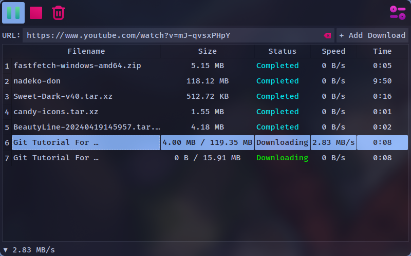

#  Nadeko~don 




## Overview
Dowload Manager built with QT


## Features

- **Multi-Protocol Support**: Download content via HTTP and HLS streaming protocols
- **Performance Control**: Configurable maximum download speed and concurrent transfer limits
- **Plugin Architecture**: Extensible functionality through YT-DLP plugin integration
- **Browser Integration**: Native Firefox support for direct capture of media streams
- **Transfer Management**: Real-time monitoring and control of active downloads

## Requirements

 - **Platform**: Windows 10/11 or Linux
 - **Dependencies**: FFMPEG


## Installation

### Binary Distribution
1. Download the latest precompiled executable from [**GitHub Releases**](https://github.com/izaz4141/Nadeko-don/releases/latest/)
2. Execute the installer package
3. (Optional) Add application directory to system PATH for command-line access

### Source Compilation
```
# Clone repository
git clone https://github.com/izaz4141/Nadeko-don.git
cd Nadeko-don

# Install Python dependencies
pip install -r requirements.txt

# Build executable
pyinstaller build.spec
```

## Development Roadmap

1. ~~Enhanced UI/UX with professional styling and dark/light themes~~
2. Improve UI with customizable themes (using qtct) ✅
3. Automatic update mechanism ✅
4. Download progress, details, visualization and analytics
5. Dynamic download part configuration during transfers
6. Download scheduling and queue management

## Browser Extensions

 - **Firefox**: [NadeCon](https://github.com/izaz4141/NadeCon)
 - **Chrome**: [Maybe?]()